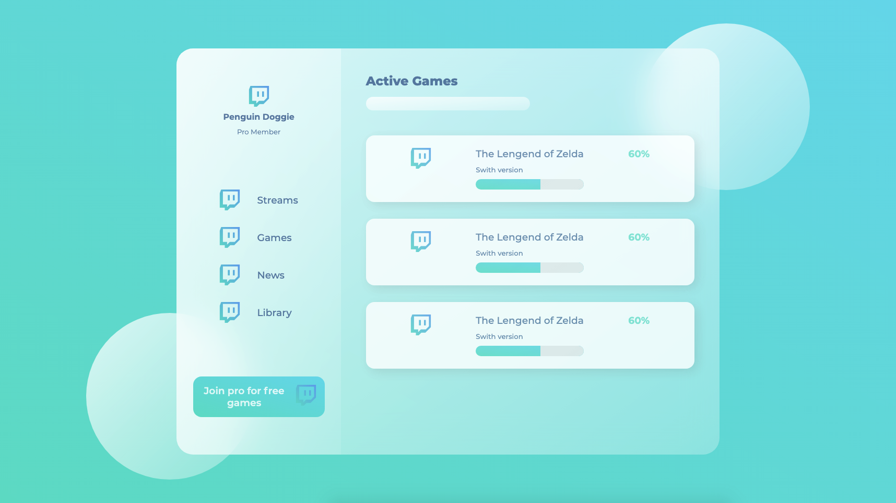
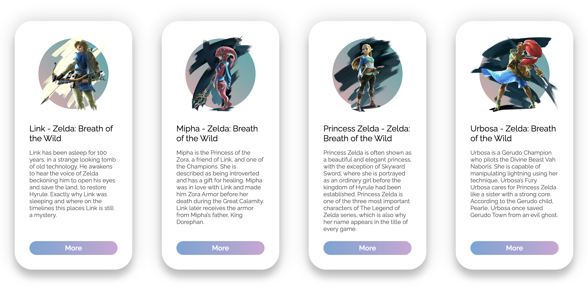

# just-for-fun
This is a repository to collect small and fun exercises.

## 1. Glass Panel
A game panel build with only html and css, with gradient color background and elements. Looks like glass!

### Hightlights
* a good practice to css *display box*
* *linear-gradient()* to realize fade color anywhere

## 2. Flexible Card
A group of character cards with javascript animation. Still, took Zelda as an example, which is my favorite game recent days...also, a time-consuming monster.

### Highlights
* **Live Sass Compiler** is a good VScode extension to compile scss to css
* Colors from **Adobe Color**
* Font from **Google Fonts** 

### Need to be fixed
* *transitionZ* does not work
* x-axis rotate to weird direction so I just ignore it at this moment
* If container width changes, the axises of each container-card need to be recaculated

## 3. Splash Page
*Splash pages are a different story, and can best be understood as an intro page to your website. When visitors arrive at your site, instead of going straight to a homepage they will first be greeted by your splash page.* -- WiX Blog
 
[What Is a Splash Page and How to Create One](https://www.wix.com/blog/2019/05/what-is-splash-page)

### Highlight
* **[GSAP](https://greensock.com/gsap/)** is a light-weight and easy tool to realize Javascript animation.
* *object-fit: cover* makes img strech to fix div, must be bounded with *width: 100%; height: 100%;* 

### Need to be fixed
* set splash page shows only once -> user first enters the website