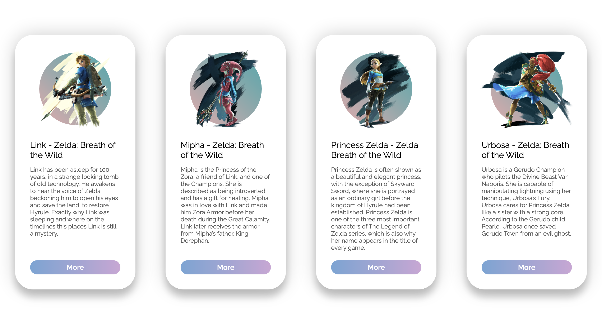

# just-for-fun
This is a repository to collect small and fun exercises.

## 1. Glass Panel
A game panel build with only html and css, with gradient color background and elements. Looks like glass!

### Hightlights
* a good practice to css *display box*
* *linear-gradient()* to realize fade color anywhere

## 2. Flexible Card
A group of character cards with javascript animation. Still, took Zelda as an example, which is my favorite game recent days...also, a time-consuming monster.

### Highlights
* **Live Sass Compiler** is a good VScode extension to compile scss to css
* Colors from **Adobe Color**
* Font from **Google Fonts** 

### Need to be fix
* *transitionZ* does not work
* x-axis rotate to weird direction so I just ignore it at this moment

